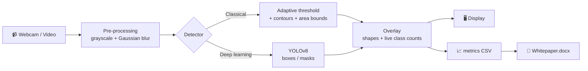
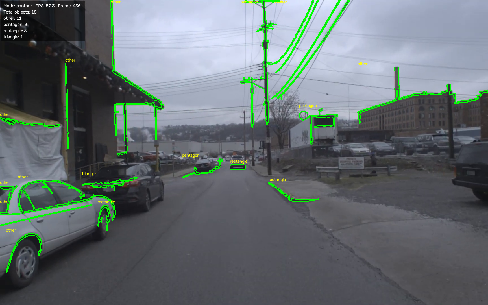
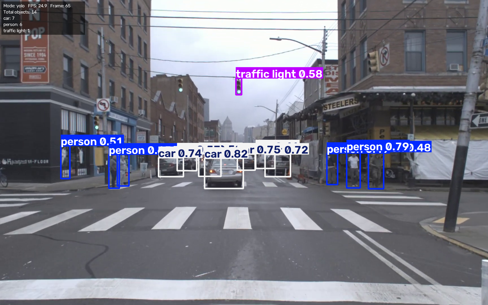

<div align="center">

# 🎯 Real-Time Object Detector & Frame-by-Frame Segmenter

**A computer vision pipeline that finds, outlines and counts objects in live video, using classical OpenCV *and* deep-learning YOLOv8, with built-in performance benchmarking.**


</div>

---

## ✨ Features

- 🎥 **Real-time processing** of a webcam stream or any video file
- 🧪 **Classical pipeline:** Gaussian filter → adaptive threshold → morphology → contours → pixel-area bounds → shape naming (triangle, square, rectangle, pentagon, circle)
- 🧠 **Deep-learning pipeline:** pre-trained **YOLOv8** detection, with optional **segmentation masks** (`-seg` model)
- 🔢 **Dynamic count overlay:** a live on-screen panel showing the number of objects per class, FPS and frame index
- 🔀 **Switch modes live:** press `m` to flip between classical and YOLO on the same video
- 📊 **Per-frame metrics:** latency, FPS, stage timings and object counts logged to CSV
- 📄 **Auto-generated whitepaper:** one command turns your results into a Word report with tables and charts

---

## 🧩 How it works



### The classical pipeline in plain words

| Step | What it does | Why |
|---|---|---|
| **Grayscale** | Colour → brightness only | Shapes don't need colour; less data to process |
| **Gaussian blur** | Smooths neighbouring pixels | Removes noise that causes false edges |
| **Adaptive threshold** | Picks a separate black/white cut-off for each small region | Works under uneven lighting and shadows |
| **Morphology** | Removes specks, fills gaps | Cleans up the mask |
| **Contours + pixel bounds** | Traces outlines, keeps only blobs within `min-area` to `max-area` | Ignores noise and huge background regions |
| **Shape classification** | Counts corners of each outline | Names the shape |

---

## 📸 Demo

> Add your screenshots to a `docs/` folder and they will appear here.

| Classical mode | YOLO mode |
|:---:|:---:|
|  |  |

---

## 🚀 Quick start (Windows + VS Code)

### 1. Clone the project
```bash
git clone https://github.com/YOUR-USERNAME/cv-object-detector-pipeline.git
cd cv-object-detector-pipeline
```

### 2. Create a virtual environment and install
```bash
python -m venv venv
venv\Scripts\activate
pip install -r requirements.txt
```

> If PowerShell blocks activation, run `Set-ExecutionPolicy -Scope CurrentUser RemoteSigned` once.

### 3. Run it
```bash
# Classical OpenCV mode on your webcam, with the threshold mask window
python pipeline.py --source 0 --mode contour --show-mask

# YOLO mode on your webcam
python pipeline.py --source 0 --mode yolo

# YOLO segmentation masks on a video file
python pipeline.py --source myvideo.mp4 --mode yolo --model yolov8n-seg.pt
```

**Keyboard controls**

| Key | Action |
|:---:|---|
| `q` | Quit |
| `m` | Switch between classical and YOLO |
| `s` | Save a screenshot to `results/` |

---

## ⚙️ Command-line options

| Option | Default | Description |
|---|---|---|
| `--source` | `0` | `0` = webcam, or a path to a video file |
| `--mode` | `contour` | `contour` or `yolo` |
| `--model` | `yolov8n.pt` | `yolov8n.pt` (detect) or `yolov8n-seg.pt` (segment) |
| `--conf` | `0.4` | YOLO confidence threshold |
| `--blur` | `5` | Gaussian kernel size (odd number) |
| `--block` | `21` | Adaptive threshold neighbourhood (odd number) |
| `--c` | `5` | Adaptive threshold constant |
| `--min-area` | `800` | Smallest contour area in pixels |
| `--max-area` | `100000` | Largest contour area in pixels |
| `--show-mask` | off | Also show the binary threshold image |
| `--save-video` | off | Save the annotated video to `results/` |
| `--max-frames` | `0` | Stop after N frames (`0` = no limit) |
| `--no-display` | off | Headless mode, useful for benchmarking |

### 🎛️ Tuning the classical mode

| Problem | Try |
|---|---|
| Lots of tiny false shapes | raise `--min-area 1500` |
| Missing real objects | lower `--c 3` or `--min-area 400` |
| Noisy mask | raise `--blur 7` |
| Large objects broken into pieces | raise `--block 31` |

---

## 📊 Benchmarking & whitepaper

Every frame is timed and saved to `results/metrics_<timestamp>.csv`.

```bash
# 1. Benchmark both methods on the same video
python pipeline.py --source myvideo.mp4 --mode contour --no-display --max-frames 2000
python pipeline.py --source myvideo.mp4 --mode yolo    --no-display --max-frames 2000

# 2. Summary statistics + charts
python analyze.py

# 3. Generate the Word whitepaper (about 5-6 pages)
python make_report.py --author "Your Name" --org "Your Organisation" --cpu "Your CPU" --ram "16 GB"
```

### Measured results (my laptop, CPU only)

| Pipeline | Mean latency | Median | P95 | Mean FPS |
|---|:---:|:---:|:---:|:---:|
| **YOLOv8n** (2000 frames) | 55.32 ms | 51.14 ms | 68.62 ms | 18.08 |
| **Classical OpenCV** | _add from analyze.py_ | | | |

**Key takeaways**
- ⚡ Detection (neural-network inference) accounts for most of YOLO's frame time, about 45 of 55 ms.
- 🐢 The single 4.2 s spike in the log is the one-off model load on the first frame; the whitepaper excludes warm-up frames.
- 🚀 GPU acceleration or a smaller input size would be the natural way to reach 30+ FPS for YOLO on this hardware.

---

## 📁 Project structure

```
cv_pipeline/
├── pipeline.py        # main real-time detector + metrics logger
├── analyze.py         # statistics and charts from the CSV logs
├── make_report.py     # builds results/Whitepaper.docx automatically
├── requirements.txt   # Python dependencies
├── docs/              # screenshots for this README
└── results/           # CSV logs, charts, screenshots, whitepaper
```

---

## 🛠️ Tech stack

- **Python** · **OpenCV** · **NumPy**
- **Ultralytics YOLOv8** (PyTorch backend)
- **pandas** · **matplotlib** for analysis
- **python-docx** for report generation

---

## 🔭 Future improvements

- [ ] Persistent object IDs for true multi-frame tracking
- [ ] Labelled test set to measure precision, recall and mAP
- [ ] GPU acceleration (CUDA) and ONNX export
- [ ] Fine-tuning YOLO on custom classes
- [ ] Simple GUI for tuning thresholds with sliders

---

## 👤 Author

**Your Name**
Internship project at **Your Organisation**
🔗 [GitHub](https://github.com/YOUR-USERNAME) · [LinkedIn](https://linkedin.com/in/your-profile)

---

<div align="center">

⭐ If you found this project useful, consider giving it a star.

</div>
